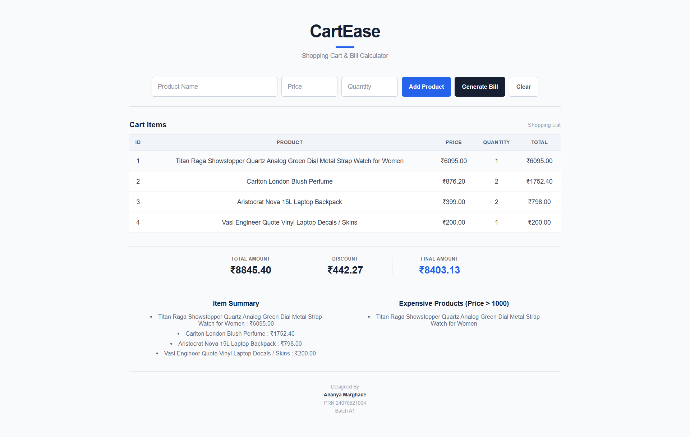
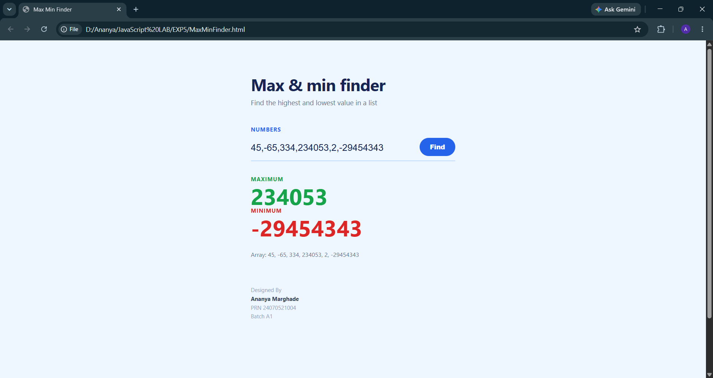

# Experiment No. 5
**Student Name:** Ananya Marghade

**PRN:** 24070521004

**BATCH:** A1

**System File Path:** `"D:\Ananya\JavaScript LAB\EXP5\exp5.html"` | `"D:\Ananya\JavaScript LAB\EXP5\expense.html"` | `"D:\Ananya\JavaScript LAB\EXP5\expense.css"` | `"D:\Ananya\JavaScript LAB\EXP5\expense.js"`

**GITHUB File Path:** `5 To create a cart total calculator with discount logic/5.1 Cart Calculator/exp5.html` | `5 To create a cart total calculator with discount logic/5.2 Expense Tracker (Array MIn Max)/expense.html` | `5 To create a cart total calculator with discount logic/5.2 Expense Tracker (Array MIn Max)/expense.css` | `5 To create a cart total calculator with discount logic/5.2 Expense Tracker (Array MIn Max)/expense.js`

---

## Experiment Title
To Create a Cart Total Calculator with Discount Logic

## Software / Tools Required
1. Visual Studio Code
2. Google Chrome
3. HTML5
4. JavaScript (ES6)

---

## Experiment Program Code

### CartEase — Shopping Cart & Bill Calculator — `exp5.html`
A shopping-cart billing tool where products (name, price, quantity) are added one at a time into an array of objects. The cart table, item summary, and a filtered list of "expensive" products (price &gt; 1000) are all re-rendered on every change using `forEach`, and the final bill is computed with `reduce()` plus slab-based discount logic.

#### `5 To create a cart total calculator with discount logic/5.1 Cart Calculator/exp5.html`
```html
<!DOCTYPE html>
<html>
<head>
    <meta charset="UTF-8">
    <title>CartEase</title>

    <style>
        * {
            box-sizing: border-box;
        }

        body {
            margin: 0;
            padding: 48px 25px;
            font-family: Arial, Helvetica, sans-serif;
            background: #f8fafc;
            color: #172033;
        }

        .container {
            width: 960px;
            max-width: 100%;
            margin: auto;
        }

        .page-heading {
            text-align: center;
            margin-bottom: 38px;
        }

        .page-heading h1 {
            margin: 0;
            font-size: 38px;
            font-weight: 700;
            letter-spacing: -1px;
            color: #172033;
        }

        .page-heading h1::after {
            content: "";
            display: block;
            width: 42px;
            height: 3px;
            background: #2563eb;
            margin: 11px auto 10px;
        }

        .page-heading p {
            margin: 0;
            font-size: 14px;
            color: #7b8492;
        }

        .input-area {
            display: flex;
            align-items: center;
            justify-content: center;
            gap: 9px;
            padding-bottom: 22px;
            border-bottom: 1px solid #d9dee7;
        }

        input {
            height: 44px;
            padding: 0 13px;
            border: 1px solid #cbd3df;
            border-radius: 5px;
            background: #ffffff;
            color: #172033;
            font-size: 14px;
            outline: none;
        }

        input:hover {
            border-color: #aeb8c7;
        }

        input:focus {
            border-color: #2563eb;
            box-shadow: 0 0 0 2px rgba(37, 99, 235, 0.08);
        }

        input::placeholder {
            color: #8b95a5;
        }

        #name {
            width: 280px;
        }

        #price,
        #qty {
            width: 125px;
        }

        .button-group {
            display: flex;
            gap: 8px;
        }

        button {
            height: 44px;
            padding: 0 16px;
            border: 0;
            border-radius: 5px;
            font-size: 13px;
            font-weight: 600;
            cursor: pointer;
            white-space: nowrap;
            transition: 0.15s ease;
        }

        .add-btn {
            background: #2563eb;
            color: white;
        }

        .add-btn:hover {
            background: #1d4ed8;
        }

        .generate-btn {
            background: #172033;
            color: white;
        }

        .generate-btn:hover {
            background: #273449;
        }

        .clear-btn {
            background: #ffffff;
            color: #4b5563;
            border: 1px solid #cbd3df;
        }

        .clear-btn:hover {
            background: #f1f5f9;
            border-color: #aeb8c7;
        }

        .table-area {
            margin-top: 30px;
        }

        .table-title {
            display: flex;
            justify-content: space-between;
            align-items: center;
            margin-bottom: 11px;
        }

        .table-title h3 {
            margin: 0;
            font-size: 17px;
            color: #172033;
        }

        .table-title span {
            font-size: 12px;
            color: #8b95a5;
        }

        table {
            width: 100%;
            border-collapse: collapse;
            background: #ffffff;
        }

        th {
            padding: 12px 10px;
            background: #f1f4f8;
            border-top: 1px solid #d6dce5;
            border-bottom: 1px solid #d6dce5;
            color: #536071;
            font-size: 11px;
            font-weight: 700;
            letter-spacing: 0.04em;
            text-transform: uppercase;
            text-align: center;
        }

        td {
            padding: 14px 10px;
            border-bottom: 1px solid #e5e9ef;
            color: #374151;
            font-size: 14px;
            text-align: center;
        }

        tr:hover td {
            background: #fafbfd;
        }

        .result {
            margin-top: 30px;
        }

        .amounts {
            display: flex;
            justify-content: center;
            align-items: center;
            border-top: 1px solid #d6dce5;
            border-bottom: 1px solid #d6dce5;
            padding: 22px 0;
            text-align: center;
        }

        .amount {
            width: 210px;
            min-width: 210px;
            padding: 0 25px;
            margin: 0;
            border-left: 1px solid #e1e5eb;
        }

        .amount:first-child {
            border-left: 0;
        }

        .amount-label {
            display: block;
            margin-bottom: 6px;
            color: #687385;
            font-size: 10px;
            font-weight: 700;
            letter-spacing: 0.07em;
            text-transform: uppercase;
        }

        .amount-value {
            font-size: 22px;
            font-weight: 700;
            color: #172033;
        }

        .final-value {
            color: #2563eb;
        }

        .result-details {
            display: grid;
            grid-template-columns: 1fr 1fr;
            gap: 70px;
            margin-top: 30px;
            padding: 0 30px 25px;
            border-bottom: 1px solid #e1e5eb;
        }

        .result-details > div {
            text-align: center;
        }

        .result-details h3 {
            margin: 0 0 13px;
            font-size: 15px;
            color: #172033;
        }

        .result-details ul {
            margin: 0;
            padding: 0;
            list-style-position: inside;
        }

        .result-details li {
            margin-bottom: 7px;
            color: #596577;
            font-size: 13px;
        }

        .footer-block {
            margin-top: 25px;
            text-align: center;
            font-size: 11px;
            color: #9aa3b1;
            line-height: 1.55;
        }

        .footer-block p {
            margin: 1px 0;
        }

        .footer-block .footer-name {
            color: #374151;
            font-weight: 600;
        }

        @media (max-width: 900px) {
            .input-area {
                flex-wrap: wrap;
            }

            #name {
                width: 100%;
            }

            #price,
            #qty {
                flex: 1;
                width: auto;
            }

            .button-group {
                width: 100%;
            }

            .button-group button {
                flex: 1;
            }
        }

        @media (max-width: 650px) {
            body {
                padding: 35px 18px;
            }

            .amounts {
                justify-content: space-between;
            }

            .amount {
                min-width: 0;
                width: auto;
                flex: 1;
                padding: 0 12px;
            }

            .result-details {
                gap: 30px;
            }

            .table-area {
                overflow-x: auto;
            }

            table {
                min-width: 650px;
            }
        }

        @media (max-width: 500px) {
            .page-heading h1 {
                font-size: 32px;
            }

            .amounts {
                display: block;
            }

            .amount {
                width: 100%;
                border-left: 0;
                border-bottom: 1px solid #e5e9ef;
                padding: 13px 0;
            }

            .amount:last-child {
                border-bottom: 0;
            }

            .result-details {
                grid-template-columns: 1fr;
                gap: 25px;
            }

            .button-group {
                flex-direction: column;
            }

            .button-group button {
                width: 100%;
            }
        }
    </style>
</head>

<body>

<div class="container">

    <div class="page-heading">
        <h1>CartEase</h1>
        <p>Shopping Cart & Bill Calculator</p>
    </div>

    <div class="input-area">

        <input
            type="text"
            id="name"
            placeholder="Product Name"
            autocomplete="off"
        >

        <input
            type="number"
            id="price"
            placeholder="Price"
            autocomplete="off"
        >

        <input
            type="number"
            id="qty"
            placeholder="Quantity"
            autocomplete="off"
        >

        <div class="button-group">
            <button class="add-btn" onclick="addProduct()">Add Product</button>
            <button class="generate-btn" onclick="generateBill()">Generate Bill</button>
            <button class="clear-btn" onclick="clearCart()">Clear</button>
        </div>

    </div>

    <div class="table-area">

        <div class="table-title">
            <h3>Cart Items</h3>
            <span>Shopping List</span>
        </div>

        <table id="cartTable">
            <tr>
                <th>ID</th>
                <th>Product</th>
                <th>Price</th>
                <th>Quantity</th>
                <th>Total</th>
            </tr>
        </table>

    </div>

    <div class="result">

        <div class="amounts">

            <div class="amount">
                <span class="amount-label">Total Amount</span>
                <span class="amount-value" id="totalAmount">₹0.00</span>
            </div>

            <div class="amount">
                <span class="amount-label">Discount</span>
                <span class="amount-value" id="discountAmount">₹0.00</span>
            </div>

            <div class="amount">
                <span class="amount-label">Final Amount</span>
                <span class="amount-value final-value" id="finalAmount">₹0.00</span>
            </div>

        </div>

        <div class="result-details">

            <div>
                <h3>Item Summary</h3>
                <ul id="summary"></ul>
            </div>

            <div>
                <h3>Expensive Products (Price &gt; 1000)</h3>
                <ul id="expensive"></ul>
            </div>

        </div>

    </div>

    <div class="footer-block">
        <p>Designed By</p>
        <p class="footer-name">Ananya Marghade</p>
        <p>PRN 24070521004</p>
        <p>Batch A1</p>
    </div>

</div>

<script>

let cart = [];

function addProduct() {

    let name = document.getElementById("name").value;
    let price = parseFloat(document.getElementById("price").value);
    let qty = parseInt(document.getElementById("qty").value);

    if (name == "" || isNaN(price) || isNaN(qty)) {
        alert("Please enter all fields");
        return;
    }

    if (price <= 0 || qty <= 0) {
        alert("Price and quantity must be greater than 0");
        return;
    }

    let product = {
        id: cart.length + 1,
        name: name,
        price: price,
        quantity: qty
    };

    cart.push(product);

    displayCart();

    document.getElementById("name").value = "";
    document.getElementById("price").value = "";
    document.getElementById("qty").value = "";

    document.getElementById("name").focus();
}

function displayCart() {

    let table = document.getElementById("cartTable");

    table.innerHTML = `
        <tr>
            <th>ID</th>
            <th>Product</th>
            <th>Price</th>
            <th>Quantity</th>
            <th>Total</th>
        </tr>
    `;

    cart.forEach(function(item) {

        table.innerHTML += `
            <tr>
                <td>${item.id}</td>
                <td>${item.name}</td>
                <td>₹${item.price.toFixed(2)}</td>
                <td>${item.quantity}</td>
                <td>₹${(item.price * item.quantity).toFixed(2)}</td>
            </tr>
        `;

    });

    calculateBill();
}

function calculateBill() {

    let total = cart.reduce(function(sum, item) {
        return sum + (item.price * item.quantity);
    }, 0);

    let discount = 0;

    if (total >= 50000) {
        discount = total * 0.20;
    }
    else if (total >= 20000) {
        discount = total * 0.10;
    }
    else if (total >= 5000) {
        discount = total * 0.05;
    }

    let finalAmount = total - discount;

    document.getElementById("totalAmount").innerText =
        "₹" + total.toFixed(2);

    document.getElementById("discountAmount").innerText =
        "₹" + discount.toFixed(2);

    document.getElementById("finalAmount").innerText =
        "₹" + finalAmount.toFixed(2);

    let summary = document.getElementById("summary");

    summary.innerHTML = "";

    cart.forEach(function(item) {

        summary.innerHTML +=
            `<li>${item.name} : ₹${(item.price * item.quantity).toFixed(2)}</li>`;

    });

    let expensive = document.getElementById("expensive");

    expensive.innerHTML = "";

    let exp = cart.filter(function(item) {
        return item.price > 1000;
    });

    exp.forEach(function(item) {

        expensive.innerHTML +=
            `<li>${item.name}</li>`;

    });
}

function generateBill() {

    if (cart.length == 0) {
        alert("Please add at least one product.");
        return;
    }

    let total = cart.reduce(function(sum, item) {
        return sum + (item.price * item.quantity);
    }, 0);

    let discount = 0;

    if (total >= 50000) {
        discount = total * 0.20;
    }
    else if (total >= 20000) {
        discount = total * 0.10;
    }
    else if (total >= 5000) {
        discount = total * 0.05;
    }

    let finalAmount = total - discount;

    alert(
        "Bill generated successfully!\n\n" +
        "Total Amount: ₹" + total.toFixed(2) + "\n" +
        "Discount: ₹" + discount.toFixed(2) + "\n" +
        "Final Amount: ₹" + finalAmount.toFixed(2)
    );
}

function clearCart() {

    cart = [];

    document.getElementById("cartTable").innerHTML = `
        <tr>
            <th>ID</th>
            <th>Product</th>
            <th>Price</th>
            <th>Quantity</th>
            <th>Total</th>
        </tr>
    `;

    document.getElementById("totalAmount").innerText = "₹0.00";
    document.getElementById("discountAmount").innerText = "₹0.00";
    document.getElementById("finalAmount").innerText = "₹0.00";

    document.getElementById("summary").innerHTML = "";
    document.getElementById("expensive").innerHTML = "";

    alert("Cart cleared successfully.");
}

</script>

</body>
</html>

```

---

## Output (Cart Calculator)
- User enters a **Product Name**, **Price**, and **Quantity** and clicks **Add Product**; empty fields or non-positive price/quantity are rejected with an `alert()`.
- Each added product is pushed into the `cart` array as an object (`id`, `name`, `price`, `quantity`) and the cart table is re-rendered via `forEach`.
- **Total Amount** is computed with `cart.reduce()`, summing `price * quantity` across all items.
- **Discount** is applied using tiered slabs: **20%** off for a cart total ≥ ₹50,000, **10%** for ≥ ₹20,000, **5%** for ≥ ₹5,000, and no discount below that — giving the **Final Amount**.
- An **Item Summary** list shows each product's line total, and an **Expensive Products** list (built with `cart.filter(item => item.price > 1000)`) highlights any product priced above ₹1000.
- **Generate Bill** shows an `alert()` summary of the total, discount, and final amount (after checking the cart isn't empty); **Clear** resets the cart, table, and summaries back to zero.

> **Screenshot:**
> 

---

## Case Study Title
Pennywise — Expense Tracker Using Arrays and Min/Max Functions

## Case Study Program Code

### Expense Tracker — `expense.html`
An expense-logging dashboard that stores every expense's amount in a plain array (`expenses`), then derives the total, average, maximum, and minimum spend from that array on every update — visually exposing the underlying array (`const expenses = [...]`) alongside its computed min/max/count.

#### `5 To create a cart total calculator with discount logic/5.2 Expense Tracker (Array MIn Max)/expense.html`
```html
<!DOCTYPE html>
<html lang="en">
<head>
<meta charset="UTF-8">
<meta name="viewport" content="width=device-width, initial-scale=1.0">
<title>Pennywise</title>
<link rel="stylesheet" href="expense.css">
</head>

<body>

<div class="container">

    <div class="top">
        <div class="title">
            <h1>Pennywise</h1>
            <p>Make every expense count</p>
        </div>
    </div>

    <div class="total-section">
        <div class="total-label">
            <span>Total Spending</span>
            <small>All recorded expenses</small>
        </div>

        <strong id="total">₹0.00</strong>
    </div>

    <div class="summary">

        <div class="summary-box">
            <p>Average Expense</p>
            <strong id="average">₹0.00</strong>
        </div>

        <div class="summary-box maximum">
            <p>Highest Expense</p>
            <strong id="maximum">₹0.00</strong>
        </div>

        <div class="summary-box minimum">
            <p>Lowest Expense</p>
            <strong id="minimum">₹0.00</strong>
        </div>

    </div>

    <div class="add">

        <div class="add-header">
            <h2>Add a new expense</h2>
            <p>Enter the details of your spending below.</p>
        </div>

        <div class="form">

            <input
                type="text"
                id="expenseName"
                placeholder="Expense name"
            >

            <input
                type="number"
                id="expenseAmount"
                placeholder="Amount"
            >

            <select id="expenseCategory">
                <option value="Food">Food</option>
                <option value="Travel">Travel</option>
                <option value="Shopping">Shopping</option>
                <option value="Bills">Bills</option>
                <option value="Other">Other</option>
            </select>

            <button onclick="addExpense()">Add</button>

        </div>

    </div>

    <div class="expenses">

        <div class="expenses-header">
            <h2>Recent Expenses</h2>
            <span>Transaction history</span>
        </div>

        <table>

            <thead>
                <tr>
                    <th>Expense</th>
                    <th>Category</th>
                    <th>Amount</th>
                </tr>
            </thead>

            <tbody id="expenseList">

                <tr>
                    <td colspan="3" class="empty">
                        No expenses added yet
                    </td>
                </tr>

            </tbody>

        </table>

    </div>

    <div class="array">

        <div class="array-top">
            <h2>Expense Array</h2>
            <span>Used for min / max calculation</span>
        </div>

        <div class="array-code" id="arrayDisplay">
            const expenses = [];
        </div>

        <div class="array-info">

            <span>
                Elements:
                <strong id="arrayCount">0</strong>
            </span>

            <span>
                Minimum:
                <strong id="arrayMin">—</strong>
            </span>

            <span>
                Maximum:
                <strong id="arrayMax">—</strong>
            </span>

        </div>

    </div>
    <footer>
        <strong>Designed By  Ananya Marghade</strong> <br>
        <strong>PRN  24070521004</strong> <br>
        <strong>BATCH A1</strong>
    </footer>

</div>

<script src="expense.js"></script>

</body>
</html>
```

### Stylesheet — `expense.css`

#### `5 To create a cart total calculator with discount logic/5.2 Expense Tracker (Array MIn Max)/expense.css`
```css
* {
    box-sizing: border-box;
}

body {
    margin: 0;
    font-family: "Segoe UI", Arial, sans-serif;
    background: #f6f8fb;
    color: #202938;
}

.container {
    width: 920px;
    max-width: 92%;
    margin: 45px auto;
}

.top {
    text-align: center;
    margin-bottom: 30px;
}

.title h1 {
    margin: 0;
    font-size: 46px;
    font-weight: 750;
    letter-spacing: -1.5px;
    color: #172b4d;
}

.title p {
    margin: 8px 0 0;
    font-size: 15px;
    font-style: italic;
    color: #78869a;
}

.total-section {
    background: linear-gradient(135deg, #eefbf6, #ffffff);
    border: 1px solid #b9e5d4;
    border-radius: 14px;
    padding: 25px 30px;
    margin-bottom: 18px;
    display: flex;
    align-items: center;
    justify-content: space-between;
    box-shadow: 0 5px 18px rgba(21, 149, 112, 0.08);
}

.total-label {
    text-align: left;
}

.total-label span {
    display: block;
    font-size: 13px;
    font-weight: 700;
    color: #477565;
    margin-bottom: 5px;
    text-transform: uppercase;
    letter-spacing: .5px;
}

.total-label small {
    font-size: 12px;
    color: #84958e;
}

.total-section strong {
    font-size: 34px;
    font-weight: 700;
    color: #10956f;
}

.summary {
    display: grid;
    grid-template-columns: repeat(3, 1fr);
    gap: 16px;
    margin-bottom: 22px;
}

.summary-box {
    background: #ffffff;
    border: 1px solid #e0e5eb;
    border-radius: 11px;
    padding: 19px 20px;
    text-align: center;
}

.summary-box p {
    margin: 0 0 8px;
    font-size: 12px;
    color: #718096;
}

.summary-box strong {
    font-size: 22px;
    color: #202938;
}

.summary-box.maximum strong {
    color: #d94841;
}

.summary-box.minimum strong {
    color: #10956f;
}

.add {
    background: #ffffff;
    border: 1px solid #e0e5eb;
    border-radius: 11px;
    padding: 23px;
    margin-bottom: 22px;
}

.add-header {
    text-align: center;
    margin-bottom: 18px;
}

.add-header h2 {
    margin: 0;
    font-size: 18px;
    font-weight: 650;
    color: #172b4d;
}

.add-header p {
    margin: 5px 0 0;
    color: #8a95a5;
    font-size: 12px;
}

.form {
    display: grid;
    grid-template-columns: 1.5fr 1fr 1fr 80px;
    gap: 10px;
}

input,
select {
    height: 44px;
    width: 100%;
    border: 1px solid #d6dde6;
    border-radius: 7px;
    padding: 0 12px;
    background: #fafbfc;
    color: #283444;
    font-size: 14px;
    outline: none;
}

input:focus,
select:focus {
    border-color: #536dfe;
    background: #ffffff;
}

button {
    height: 44px;
    border: none;
    border-radius: 7px;
    background: #536dfe;
    color: white;
    font-size: 14px;
    font-weight: 600;
    cursor: pointer;
}

button:hover {
    background: #4357d8;
}

.expenses {
    background: #ffffff;
    border: 1px solid #e0e5eb;
    border-radius: 11px;
    overflow: hidden;
    margin-bottom: 22px;
}

.expenses-header {
    display: flex;
    justify-content: space-between;
    align-items: center;
    padding: 20px 22px;
    border-bottom: 1px solid #edf0f3;
}

.expenses-header h2 {
    margin: 0;
    font-size: 18px;
    font-weight: 650;
    color: #172b4d;
}

.expenses-header span {
    font-size: 12px;
    color: #8a94a0;
}

table {
    width: 100%;
    border-collapse: collapse;
}

th {
    padding: 12px 22px;
    text-align: left;
    background: #f9fafb;
    color: #7b8796;
    font-size: 11px;
    font-weight: 600;
    text-transform: uppercase;
    letter-spacing: .5px;
}

td {
    padding: 15px 22px;
    border-top: 1px solid #f0f2f4;
    font-size: 14px;
}

td:first-child {
    color: #202938;
    font-weight: 600;
}

td:nth-child(2) {
    color: #7c8794;
}

td:last-child,
th:last-child {
    text-align: right;
}

.empty {
    text-align: center !important;
    padding: 38px !important;
    color: #9aa5b2 !important;
    font-weight: 400 !important;
}

.array {
    background: #ffffff;
    border: 1px solid #e0e5eb;
    border-radius: 11px;
    padding: 21px 22px;
}

.array-top {
    display: flex;
    justify-content: space-between;
    align-items: center;
    margin-bottom: 13px;
}

.array-top h2 {
    margin: 0;
    font-size: 17px;
    font-weight: 650;
    color: #172b4d;
}

.array-top span {
    color: #8a94a0;
    font-size: 11px;
}

.array-code {
    background: #f6f8fa;
    border: 1px solid #e0e5eb;
    border-radius: 7px;
    padding: 14px 15px;
    font-family: Consolas, monospace;
    font-size: 13px;
    color: #334155;
    text-align: left;
    overflow-x: auto;
}

.array-info {
    display: flex;
    justify-content: center;
    gap: 35px;
    margin-top: 14px;
    font-size: 12px;
    color: #7b8490;
}

.array-info strong {
    color: #202938;
}

footer {
    text-align: center;
    margin-top: 30px;
    padding-bottom: 10px;
    color: #7d8792;
    font-size: 16px;
}

footer strong {
    color: #4f5965;
}

@media (max-width: 720px) {
    .summary {
        grid-template-columns: 1fr;
    }

    .form {
        grid-template-columns: 1fr 1fr;
    }
}

@media (max-width: 480px) {
    .container {
        max-width: 94%;
    }

    .title h1 {
        font-size: 38px;
    }

    .form {
        grid-template-columns: 1fr;
    }

    .total-section {
        flex-direction: column;
        gap: 12px;
        text-align: center;
    }

    .total-label {
        text-align: center;
    }

    .array-info {
        flex-direction: column;
        gap: 7px;
        align-items: center;
    }
}

```

### Expense Logic — `expense.js`
Builds an `amounts` array from the `expenses` objects using `map()`, then derives `total` via `reduce()`, and `maximum`/`minimum` via `Math.max(...amounts)` / `Math.min(...amounts)` (the spread operator applied to array min/max functions), with `average` computed from total and count.

#### `5 To create a cart total calculator with discount logic/5.2 Expense Tracker (Array MIn Max)/expense.js`
```js
const expenses = [];

function addExpense() {

    const name = document.getElementById("expenseName").value.trim();
    const amount = Number(document.getElementById("expenseAmount").value);
    const category = document.getElementById("expenseCategory").value;

    if (name === "" || amount <= 0 || isNaN(amount)) {
        alert("Please enter a valid expense.");
        return;
    }

    const expense = {
        name: name,
        amount: amount,
        category: category
    };

    expenses.push(expense);

    document.getElementById("expenseName").value = "";
    document.getElementById("expenseAmount").value = "";

    updateExpenseData();
}

function updateExpenseData() {

    const amounts = expenses.map(function(expense) {
        return expense.amount;
    });

    const expenseReport = {
        expenses: amounts,
        total: amounts.reduce(function(sum, amount) {
            return sum + amount;
        }, 0),
        maximum: Math.max(...amounts),
        minimum: Math.min(...amounts),
        count: amounts.length
    };

    expenseReport.average =
        expenseReport.total / expenseReport.count;

    document.getElementById("total").textContent =
        "₹" + expenseReport.total.toFixed(2);

    document.getElementById("average").textContent =
        "₹" + expenseReport.average.toFixed(2);

    document.getElementById("maximum").textContent =
        "₹" + expenseReport.maximum.toFixed(2);

    document.getElementById("minimum").textContent =
        "₹" + expenseReport.minimum.toFixed(2);

    document.getElementById("arrayDisplay").textContent =
        "const expenses = [" + amounts.join(", ") + "];";

    document.getElementById("arrayCount").textContent =
        expenseReport.count;

    document.getElementById("arrayMin").textContent =
        "₹" + expenseReport.minimum.toFixed(2);

    document.getElementById("arrayMax").textContent =
        "₹" + expenseReport.maximum.toFixed(2);

    const list = document.getElementById("expenseList");

    list.innerHTML = expenses.map(function(expense) {

        return `
            <tr>
                <td>${expense.name}</td>
                <td>${expense.category}</td>
                <td>₹${expense.amount.toFixed(2)}</td>
            </tr>
        `;

    }).join("");
}
```

---

## Output (Case Study — Expense Tracker)
- User enters an **Expense name**, **Amount**, and selects a **Category** (Food, Travel, Shopping, Bills, Other), then clicks **Add**; invalid or non-positive amounts are rejected with an `alert()`.
- Each expense is pushed into the `expenses` array and the **Recent Expenses** table is rebuilt via `.map().join("")`.
- **Total Spending**, **Average Expense**, **Highest Expense**, and **Lowest Expense** are recalculated on every add, using `reduce()` for the total/average and `Math.max()` / `Math.min()` with the spread operator for the highest/lowest.
- The **Expense Array** panel displays the live underlying array as a code string (`const expenses = [120, 450, ...];`) along with its element count, minimum, and maximum — making the array-based min/max computation visible to the user.

> **Note:** `Math.max()` / `Math.min()` return `-Infinity` / `Infinity` on an empty array, so the **Highest**/**Lowest Expense** and array min/max fields only display meaningful values once at least one expense has been added.

> **Screenshot:** *(a standalone Max/Min Finder utility demonstrating the same `Math.max(...array)` / `Math.min(...array)` concept used inside Pennywise's expense calculations)*
> 

---

## Result / Conclusion
The practical was completed successfully. Arrays of objects, array methods (`push`, `forEach`, `map`, `filter`, `reduce`), and `Math.max()`/`Math.min()` (with the spread operator) were used to build two applications: **CartEase**, a shopping-cart bill calculator with slab-based discount logic and a filtered "expensive products" list, and **Pennywise**, an expense tracker that derives total, average, maximum, and minimum spending directly from a live array of recorded expenses.
