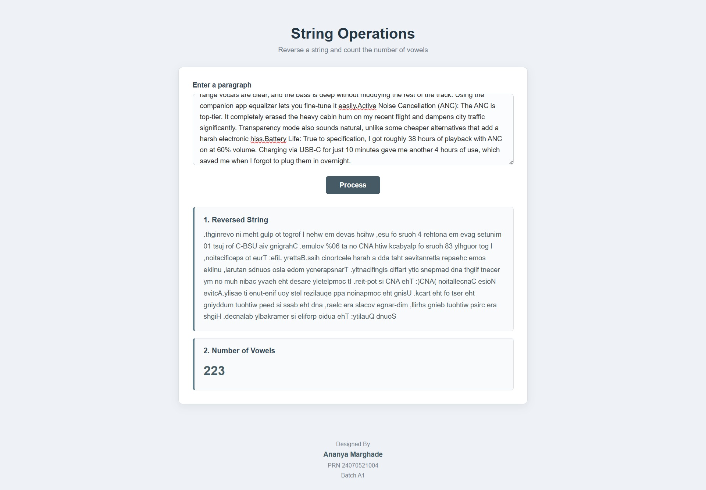
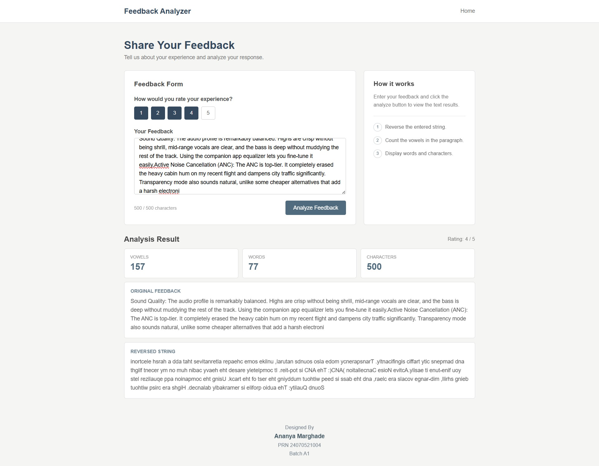

# Experiment No. 6
**Student Name:** Ananya Marghade

**PRN:** 24070521004

**BATCH:** A1

**System File Path:** `"D:\Ananya\JavaScript LAB\EXP6\exp6.html"` | `"D:\Ananya\JavaScript LAB\EXP6\exp6 case study.html"` | `"D:\Ananya\JavaScript LAB\EXP6\feedback form.html"`

**GITHUB File Path:** `6 Use string functions and regex  for validation/exp6.html` | `6 Use string functions and regex  for validation/exp6 case study.html` | `6 Use string functions and regex  for validation/feedback form.html`

---

## Experiment Title
Use String Functions and Regular Expressions for Validation

## Software / Tools Required
1. Visual Studio Code
2. Google Chrome
3. HTML5
4. JavaScript (ES6)

---

## Experiment Program Code

### String Methods & Regular Expressions — `exp6.html`
A single-page demo that takes a paragraph and an email address as input and runs them through a full set of string methods and regex operations: `split()` to break the paragraph into words, `match()` with a regex to pull out and count vowels, `replace()` to substitute a matched word, `indexOf()` to locate a search term, a regex-based email validator, `match()` again (with the global flag) to extract every email address from a block of text, and `split().reverse().join()` to reverse the whole paragraph.

#### `6 Use string functions and regex  for validation/exp6.html`
```html
<!DOCTYPE html>
<html>
    <head>
        <title>
            String Methods and Regular Expressions
        </title>

        <style>
            body {
                font-family: Arial, sans-serif;
                margin: 40px;
            }

            h1 {
                text-align: center;
            }

            .box {
                border: 1px solid #ccc;
                padding: 20px;
                margin-top: 20px;
                border-radius: 8px;
            } 

            input, textarea, button {
                padding: 10px;
                margin: 5px 0;
                width: 90%;
            }

            button {
                width: 150px;
                cursor: pointer;
            }

            #output {
                margin-top: 20px;
                padding: 15px;
                background-color: #f5f5f5;
            } 
        </style>
    </head>

    <body>
        <h1>String Methods & Regular Expressions</h1>
        <div class="box">
            <label><b>Enter a paragraph:</b></label> <br>

            <textarea id="paragraph" rows="5">Javascript is a powerful programming language. It is widely used for web development.
            </textarea>
            <br>

            <label><b>Enter Email:</b></label> <br> 
            <input type="text" id="email" placeholder="Enter your email"> <br>

            <button onclick="processString()">Process</button>
            <div id="output"></div>
        </div>

        <script>
            function processString() {
                let paragraph = document.getElementById("paragraph").value;
                let email = document.getElementById("email").value; 

                let words = paragraph.split(/\s+/);

                let vowels = paragraph.match(/[aeiou]/gi); 
                let vowelCount = vowels ? vowels.length : 0; 

                let replacedParagraph = paragraph.replace(
                    /JavaScript/gi, 
                    "JavaScript Programming"
                ); 

                let searchWord = "powerful"; 
                let position = paragraph.indexOf(searchWord); 

                let emailRegex = 
                /^[a-zA-Z0-9._%+-]+@[a-zA-Z0-9.-]+\.[a-zA-Z]{2,}$/; 

                let emailResult; 

                if(emailRegex.test(email)) {
                    emailResult = "Valid Email Address"; 
                } else {
                    emailResult = "Invalid Email Address";
                }
                let emailText = 
                "For queries contact student@example.com or admin@college.edu"; 

                let extractedEmails = emailText.match(
                    /[a-zA-Z0-9._%+-]+@[a-zA-z0-9.-]+\.[a-zA-Z]{2,}/g 
                ); 

                let reeversedParagraph = paragraph.split("").reverse().join(""); 

                document.getElementById("output").innerHTML = `
                <h3>1. Original Paragraph</h3>
                <p>${paragraph}</p> 

                <h3> 2. split() - Words </h3>
                <p> ${words.join(",")}</p>

                <h3> 3. match() - Vowels </h3>
                <p> {vowels ? vowels.join(", "): "NO VOWELS FOUND!"}</p>

                <h3> 4. Vowel Count </h3>
                <p> Total number of vowels: <b>${vowelCount}</b></p>

                <h3> 5. replace() - Replace Text </h3>
                <p> ${replacedParagraph} </p>

                <h3> 6. indexOf() - Search Word </h3>
                <p>
                    Position of "<b> ${searchWord}</b>":
                    <b> ${position} </b>
                </p>

                <h3> 7. Email Validation using Regex </h3>
                <p>
                    Email: <b>${email}</b><br>
                    Result: <b>${emailResult}</b>
                </p>

                <h3> 8. Regex - Extracted Information </h3>
                <p>
                    ${extractedEmails ? extractedEmails.join("<br>") : "NO EMAIL ADDRESS FOUND!"}
                </p>

                <h3> 9. Reversed Paragraph </h3>
                <p> ${reeversedParagraph} </p>
                `;
            }
        </script>
    </body>
</html>
```

---

## Output (exp6.html)
- User enters a paragraph in the textarea (a default sample paragraph is pre-filled) and, optionally, an email address, then clicks **Process**.
- **`split()` — Words:** the paragraph is split on whitespace and every word is listed out.
- **`match()` — Vowels:** a global, case-insensitive regex (`/[aeiou]/gi`) matches every vowel in the paragraph and reports the total vowel count.
- **`replace()` — Replace Text:** every case-insensitive occurrence of "JavaScript" in the paragraph is replaced with "JavaScript Programming".
- **`indexOf()` — Search Word:** the character position of the word "powerful" inside the paragraph is located and displayed.
- **Email Validation using Regex:** the entered email is tested against `/^[a-zA-Z0-9._%+-]+@[a-zA-Z0-9.-]+\.[a-zA-Z]{2,}$/` and reported as a **Valid** or **Invalid Email Address**.
- **Regex — Extracted Information:** a global regex scans a fixed block of contact text and extracts every email address it finds.
- **Reversed Paragraph:** the entire paragraph is reversed character-by-character using `split("").reverse().join("")`.

---

## Case Study Title
String Operations & Feedback Analyzer — Real-World Applications of String Methods and Regex

## Case Study Program Code

### 1. String Operations — `exp6 case study.html`
A focused mini-tool that takes a single paragraph and performs two string operations on it: reversing the string and counting the number of vowels it contains, each shown in its own result card.

#### `6 Use string functions and regex  for validation/exp6 case study.html`
```html
<!DOCTYPE html>
<html>
<head>
    <title>String Operations</title>

    <style>
        * {
            box-sizing: border-box;
        }

        body {
            margin: 0;
            font-family: Arial, Helvetica, sans-serif;
            background: #eef2f6;
            color: #2f3a45;
        }

        .container {
            width: 760px;
            max-width: 92%;
            margin: 55px auto;
        }

        .header {
            text-align: center;
            margin-bottom: 28px;
        }

        .header h1 {
            margin: 0;
            font-size: 32px;
            color: #263746;
            font-weight: 600;
        }

        .header p {
            margin: 9px 0 0;
            color: #74808b;
            font-size: 15px;
        }

        .box {
            background: #ffffff;
            border: 1px solid #d9e0e6;
            border-radius: 10px;
            padding: 30px;
            box-shadow: 0 5px 18px rgba(40, 55, 70, 0.08);
        }

        .input-title {
            display: block;
            font-size: 15px;
            font-weight: bold;
            color: #354452;
            margin-bottom: 10px;
        }

        textarea {
            width: 100%;
            min-height: 155px;
            padding: 14px 15px;
            border: 1px solid #cbd4dc;
            border-radius: 7px;
            background: #fbfcfd;
            color: #333;
            font-family: Arial, Helvetica, sans-serif;
            font-size: 15px;
            line-height: 1.6;
            resize: vertical;
            outline: none;
            transition: border-color 0.2s, box-shadow 0.2s;
        }

        textarea::placeholder {
            color: #a1aab2;
        }

        textarea:focus {
            border-color: #607d8b;
            box-shadow: 0 0 0 3px rgba(96, 125, 139, 0.10);
            background: #fff;
        }

        button {
            display: block;
            margin: 20px auto 0;
            padding: 11px 30px;
            border: none;
            border-radius: 6px;
            background: #455a64;
            color: white;
            font-size: 15px;
            font-weight: bold;
            cursor: pointer;
            transition: background 0.2s, transform 0.2s;
        }

        button:hover {
            background: #37474f;
            transform: translateY(-1px);
        }

        button:active {
            transform: translateY(0);
        }

        #output {
            margin-top: 28px;
        }

        .result {
            background: #f8fafb;
            border: 1px solid #dce3e8;
            border-left: 4px solid #607d8b;
            border-radius: 6px;
            padding: 18px 20px;
            margin-top: 15px;
        }

        .result h3 {
            margin: 0 0 10px;
            color: #374957;
            font-size: 16px;
            font-weight: bold;
        }

        .result p {
            margin: 0;
            color: #505c66;
            font-size: 15px;
            line-height: 1.7;
            word-break: break-word;
        }

        .count {
            font-size: 28px !important;
            font-weight: bold;
            color: #455a64 !important;
        }

        .empty {
            text-align: center;
            color: #777;
        }

        @media (max-width: 600px) {
            .container {
                margin: 30px auto;
            }

            .box {
                padding: 20px;
            }

            .header h1 {
                font-size: 26px;
            }

            textarea {
                min-height: 130px;
            }
        }
        .footer {
            text-align: center;
            margin-top: 35px;
            padding: 20px 10px;
            color: #74808b;
            font-size: 13px;
            line-height: 1.5;
        }

        .footer p {
            margin: 2px 0;
        }

        .footer-name {
            font-size: 15px;
            font-weight: bold;
            color: #455a64;
        }
    </style>
</head>

<body>

    <div class="container">

        <div class="header">
            <h1>String Operations</h1>
            <p>Reverse a string and count the number of vowels</p>
        </div>

        <div class="box">

            <label class="input-title" for="paragraph">
                Enter a paragraph
            </label>

            <textarea id="paragraph"
                placeholder="Type or paste your paragraph here..."></textarea>

            <button onclick="processString()">Process</button>

            <div id="output"></div>

        </div>

    </div>

    <script>
        function processString() {

            let paragraph = document.getElementById("paragraph").value;

            if (paragraph.trim() === "") {
                document.getElementById("output").innerHTML = `
                    <div class="result empty">
                        <p>Please enter a paragraph first.</p>
                    </div>
                `;
                return;
            }

            let reversedString = paragraph.split("").reverse().join("");

            let vowels = paragraph.match(/[aeiou]/gi);
            let vowelCount = vowels ? vowels.length : 0;

            document.getElementById("output").innerHTML = `
                <div class="result">
                    <h3>1. Reversed String</h3>
                    <p>${reversedString}</p>
                </div>

                <div class="result">
                    <h3>2. Number of Vowels</h3>
                    <p class="count">${vowelCount}</p>
                </div>
            `;
        }
    </script>
<footer class="footer">
    <p>Designed By</p>
    <p class="footer-name">Ananya Marghade</p>
    <p>PRN 24070521004</p>
    <p>Batch A1</p>
</footer>
</body>
</html>
```

#### Output
- User types or pastes a paragraph into the textarea and clicks **Process**.
- If the textarea is left empty, an inline "Please enter a paragraph first." message is shown instead of results.
- On valid input, two result cards are rendered: the **Reversed String** (`paragraph.split("").reverse().join("")`) and the **Number of Vowels** (counted with the regex `/[aeiou]/gi`).

> **Screenshot:**
> 

---

### 2. Feedback Analyzer — `feedback form.html`
*(previously `e6.html`)*

A styled feedback form that combines a 1–5 star-style rating widget with a live character counter and a string-analysis engine. On submission it reverses the feedback text and reports its vowel count, word count, and character count — applying the same `split()`, `match()`, and `reverse()` string techniques from the main experiment inside a realistic feedback-collection UI.

#### `6 Use string functions and regex  for validation/feedback form.html`
```html
<!DOCTYPE html>
<html>
<head>
    <title>Feedback Analyzer</title>

    <style>
        * {
            box-sizing: border-box;
        }

        body {
            margin: 0;
            font-family: Arial, Helvetica, sans-serif;
            background: #f5f5f4;
            color: #333;
        }

        .topbar {
            height: 58px;
            background: #fff;
            border-bottom: 1px solid #ddd;
            display: flex;
            align-items: center;
        }

        .topbar-inner {
            width: 900px;
            max-width: 92%;
            margin: auto;
            display: flex;
            justify-content: space-between;
            align-items: center;
        }

        .logo {
            font-size: 19px;
            font-weight: bold;
            color: #34495e;
        }

        .topbar a {
            color: #777;
            text-decoration: none;
            font-size: 14px;
        }

        .main {
            width: 900px;
            max-width: 92%;
            margin: 42px auto;
        }

        .intro {
            margin-bottom: 25px;
        }

        .intro h1 {
            margin: 0 0 7px;
            font-size: 28px;
            font-weight: 600;
            color: #34495e;
        }

        .intro p {
            margin: 0;
            color: #777;
            font-size: 14px;
        }

        .layout {
            display: grid;
            grid-template-columns: 1fr 285px;
            gap: 20px;
        }

        .card {
            background: #fff;
            border: 1px solid #ddd;
            border-radius: 6px;
        }

        .form-card {
            padding: 25px;
        }

        .form-title {
            font-size: 17px;
            font-weight: bold;
            color: #444;
            margin-bottom: 20px;
        }

        .question {
            font-size: 14px;
            font-weight: bold;
            color: #555;
            margin-bottom: 10px;
        }

        .rating {
            display: flex;
            gap: 7px;
            margin-bottom: 22px;
        }

        .rating button {
            width: 36px;
            height: 34px;
            padding: 0;
            border: 1px solid #ccc;
            background: #fff;
            color: #555;
            border-radius: 4px;
            cursor: pointer;
        }

        .rating button:hover,
        .rating button.active {
            background: #34495e;
            border-color: #34495e;
            color: #fff;
        }

        label {
            display: block;
            font-size: 14px;
            font-weight: bold;
            color: #555;
            margin-bottom: 8px;
        }

        textarea {
            width: 100%;
            height: 145px;
            padding: 12px;
            border: 1px solid #ccc;
            border-radius: 4px;
            resize: vertical;
            outline: none;
            font-family: Arial, Helvetica, sans-serif;
            font-size: 14px;
            line-height: 1.6;
        }

        textarea:focus {
            border-color: #8293a2;
        }

        textarea::placeholder {
            color: #aaa;
        }

        .bottom-row {
            margin-top: 12px;
            display: flex;
            justify-content: space-between;
            align-items: center;
        }

        .counter {
            font-size: 12px;
            color: #999;
        }

        .analyze-btn {
            border: none;
            background: #506a7e;
            color: white;
            padding: 10px 20px;
            border-radius: 4px;
            font-size: 14px;
            cursor: pointer;
        }

        .analyze-btn:hover {
            background: #40586a;
        }

        #error {
            display: none;
            margin-top: 10px;
            color: #a94442;
            font-size: 13px;
        }

        .info-card {
            padding: 24px;
        }

        .info-card h2 {
            margin: 0 0 12px;
            font-size: 17px;
            color: #444;
        }

        .info-card p {
            margin: 0;
            color: #777;
            font-size: 13px;
            line-height: 1.6;
        }

        .line {
            height: 1px;
            background: #e5e5e5;
            margin: 18px 0;
        }

        .info-item {
            display: flex;
            gap: 9px;
            margin-bottom: 13px;
            color: #666;
            font-size: 13px;
            line-height: 1.5;
        }

        .number {
            min-width: 21px;
            height: 21px;
            border: 1px solid #c9d0d5;
            border-radius: 50%;
            display: flex;
            justify-content: center;
            align-items: center;
            color: #5d7282;
            font-size: 11px;
        }

        #result {
            display: none;
            margin-top: 25px;
        }

        .result-header {
            display: flex;
            justify-content: space-between;
            align-items: center;
            margin-bottom: 13px;
        }

        .result-header h2 {
            margin: 0;
            font-size: 19px;
            font-weight: 600;
            color: #444;
        }

        .rating-result {
            font-size: 13px;
            color: #777;
        }

        .stats {
            display: grid;
            grid-template-columns: repeat(3, 1fr);
            gap: 10px;
        }

        .stat {
            background: #fff;
            border: 1px solid #ddd;
            border-radius: 5px;
            padding: 15px;
        }

        .stat-label {
            font-size: 11px;
            color: #888;
            text-transform: uppercase;
        }

        .stat-value {
            margin-top: 6px;
            font-size: 23px;
            font-weight: bold;
            color: #506a7e;
        }

        .result-box {
            margin-top: 10px;
            background: #fff;
            border: 1px solid #ddd;
            border-radius: 5px;
            padding: 16px;
        }

        .result-box h3 {
            margin: 0 0 8px;
            font-size: 12px;
            color: #667b8a;
            text-transform: uppercase;
        }

        .result-box p {
            margin: 0;
            font-size: 14px;
            color: #555;
            line-height: 1.6;
            word-break: break-word;
        }

        @media (max-width: 700px) {
            .layout {
                grid-template-columns: 1fr;
            }

            .info-card {
                display: none;
            }
        }

        @media (max-width: 500px) {
            .main {
                margin: 30px auto;
            }

            .intro h1 {
                font-size: 25px;
            }

            .bottom-row {
                flex-direction: column;
                align-items: stretch;
                gap: 10px;
            }

            .analyze-btn {
                width: 100%;
            }

            .stats {
                grid-template-columns: 1fr;
            }
        }
        .footer {
            text-align: center;
            margin-top: 35px;
            padding: 20px 10px;
            color: #74808b;
            font-size: 13px;
            line-height: 1.5;
        }

        .footer p {
            margin: 2px 0;
        }

        .footer-name {
            font-size: 15px;
            font-weight: bold;
            color: #455a64;
        }
    </style>
</head>

<body>

    <div class="topbar">
        <div class="topbar-inner">
            <div class="logo">Feedback Analyzer</div>
            <a href="#">Home</a>
        </div>
    </div>

    <div class="main">

        <div class="intro">
            <h1>Share Your Feedback</h1>
            <p>Tell us about your experience and analyze your response.</p>
        </div>

        <div class="layout">

            <div class="card form-card">

                <div class="form-title">Feedback Form</div>

                <div class="question">
                    How would you rate your experience?
                </div>

                <div class="rating">
                    <button onclick="setRating(1)">1</button>
                    <button onclick="setRating(2)">2</button>
                    <button onclick="setRating(3)">3</button>
                    <button onclick="setRating(4)">4</button>
                    <button onclick="setRating(5)">5</button>
                </div>

                <label for="feedback">Your Feedback</label>

                <textarea id="feedback"
                    maxlength="500"
                    oninput="updateCount()"
                    placeholder="Write your feedback here..."></textarea>

                <div class="bottom-row">
                    <span class="counter" id="counter">
                        0 / 500 characters
                    </span>

                    <button class="analyze-btn" onclick="analyzeFeedback()">
                        Analyze Feedback
                    </button>
                </div>

                <div id="error">
                    Please enter your feedback before analyzing.
                </div>

            </div>

            <div class="card info-card">

                <h2>How it works</h2>

                <p>
                    Enter your feedback and click the analyze button
                    to view the text results.
                </p>

                <div class="line"></div>

                <div class="info-item">
                    <span class="number">1</span>
                    <span>Reverse the entered string.</span>
                </div>

                <div class="info-item">
                    <span class="number">2</span>
                    <span>Count the vowels in the paragraph.</span>
                </div>

                <div class="info-item">
                    <span class="number">3</span>
                    <span>Display words and characters.</span>
                </div>

            </div>

        </div>

        <div id="result">

            <div class="result-header">
                <h2>Analysis Result</h2>
                <span class="rating-result" id="ratingResult"></span>
            </div>

            <div class="stats">

                <div class="stat">
                    <div class="stat-label">Vowels</div>
                    <div class="stat-value" id="vowels">0</div>
                </div>

                <div class="stat">
                    <div class="stat-label">Words</div>
                    <div class="stat-value" id="words">0</div>
                </div>

                <div class="stat">
                    <div class="stat-label">Characters</div>
                    <div class="stat-value" id="characters">0</div>
                </div>

            </div>

            <div class="result-box">
                <h3>Original Feedback</h3>
                <p id="original"></p>
            </div>

            <div class="result-box">
                <h3>Reversed String</h3>
                <p id="reversed"></p>
            </div>

        </div>

    </div>

    <script>
        let selectedRating = 0;

        function setRating(rating) {
            selectedRating = rating;

            let buttons = document.querySelectorAll(".rating button");

            buttons.forEach(function(button, index) {
                button.classList.toggle("active", index < rating);
            });
        }

        function updateCount() {
            let feedback = document.getElementById("feedback").value;
            document.getElementById("counter").innerText =
                feedback.length + " / 500 characters";
        }

        function analyzeFeedback() {
            let feedback = document.getElementById("feedback").value;
            let error = document.getElementById("error");
            let result = document.getElementById("result");

            if (feedback.trim() === "") {
                error.style.display = "block";
                result.style.display = "none";
                return;
            }

            error.style.display = "none";

            let reversed = feedback.split("").reverse().join("");

            let vowelList = feedback.match(/[aeiou]/gi);
            let vowelCount = vowelList ? vowelList.length : 0;

            let wordList = feedback.trim().split(/\s+/);
            let wordCount = wordList.length;

            let characterCount = feedback.length;

            document.getElementById("vowels").innerText = vowelCount;
            document.getElementById("words").innerText = wordCount;
            document.getElementById("characters").innerText = characterCount;

            document.getElementById("original").innerText = feedback;
            document.getElementById("reversed").innerText = reversed;

            if (selectedRating > 0) {
                document.getElementById("ratingResult").innerText =
                    "Rating: " + selectedRating + " / 5";
            } else {
                document.getElementById("ratingResult").innerText = "";
            }

            result.style.display = "block";
        }
    </script>
<footer class="footer">
    <p>Designed By</p>
    <p class="footer-name">Ananya Marghade</p>
    <p>PRN 24070521004</p>
    <p>Batch A1</p>
</footer>
</body>
</html>
```

#### Output
- User rates their experience (1–5, via the rating buttons) and types feedback into the textarea, whose character counter updates live against a 500-character limit.
- Clicking **Analyze Feedback** with empty input shows an inline validation error ("Please enter your feedback before analyzing.") and hides the results section.
- On valid input, the **Analysis Result** section displays three stat cards — **Vowels** (via `match(/[aeiou]/gi)`), **Words** (via `trim().split(/\s+/)`), and **Characters** (`.length`) — along with the **Original Feedback** and the **Reversed String** (`split("").reverse().join("")`), plus the selected star rating.

> **Screenshot:**
> 

---

## Result / Conclusion
The practical was completed successfully. Core string methods (`split()`, `match()`, `replace()`, `indexOf()`, `reverse()`, `join()`) and regular expressions were used to process and validate text — from a general-purpose string/regex demo (word splitting, vowel counting, text replacement, search, email validation and extraction, and string reversal) to two applied case studies: a simple string-operations tool and a fully styled Feedback Analyzer that reverses and analyzes user-submitted feedback in real time.
