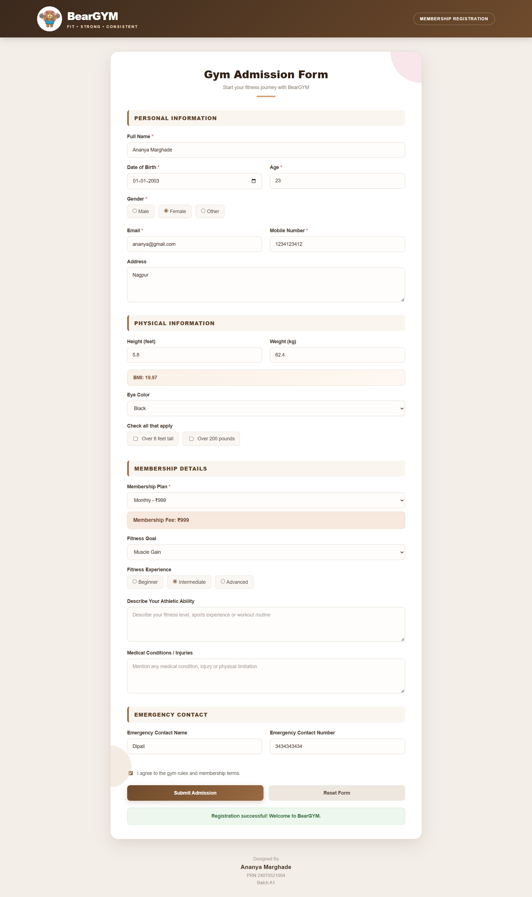

# Experiment No. 8
**Student Name:** Ananya Marghade

**PRN:** 24070521004

**BATCH:** A1

**System File Path:** `"D:\Ananya\JavaScript LAB\EXP8\exp8.html"` | `"D:\Ananya\JavaScript LAB\EXP8\exp8casestudy.html"`

**GITHUB File Path:** `8 Access and validate form fields using events/exp8.html` | `8 Access and validate form fields using events/exp8casestudy.html`

---

## Experiment Title
Access and Validate Form Fields Using Events

## Software / Tools Required
1. Visual Studio Code
2. Google Chrome
3. HTML5
4. JavaScript (ES6)

---

## Experiment Program Code

### Gym Admission Form — `exp8.html`
A compact membership registration form that demonstrates the core event-driven validation pattern: each field (Name, Age, Email, Mobile Number) is accessed with `getElementById()` and validated on `blur` using regex (`/^[A-Za-z ]+$/` for the name, `/^\d{10}$/` for the mobile number) or a simple range check, with the matching `focus` listener clearing that field's error as soon as the user returns to it. The Membership Plan dropdown is validated on `change`, and the form's `submit` handler re-checks that every error span is empty and a plan is selected before showing a success message — `event.preventDefault()` stops the page from reloading, and an `alert()` fires if any check fails.

#### `8 Access and validate form fields using events/exp8.html`
```html
<!DOCTYPE html>
<html>
<head>
    <title>Gym Admission Form</title>
    <style>
        @import url('https://fonts.googleapis.com/css2?family=Space+Grotesk:wght@500;700&family=Inter:wght@400;500;600&display=swap');

        *{
            box-sizing:border-box;
        }

        body{
            font-family:'Inter', Arial, sans-serif;
            background:#f4f2ee;
            min-height:100vh;
            margin:0;
            display:flex;
            flex-direction:column;
            align-items:center;
            justify-content:center;
            padding:40px 20px;
        }

        .container{
            width:100%;
            max-width:520px;
            background:#ffffff;
            border:1px solid #e4e0d8;
            border-radius:6px;
            box-shadow:0 12px 40px rgba(30,25,15,0.08);
            overflow:hidden;
        }

        .banner{
            background:#1f4d3a;
            padding:26px 32px;
        }

        .banner .eyebrow{
            font-size:12px;
            font-weight:600;
            color:#8fbfa5;
            margin:0 0 6px;
        }

        .banner h2{
            font-family:'Space Grotesk', sans-serif;
            font-size:24px;
            font-weight:700;
            color:#ffffff;
            margin:0 0 4px;
            letter-spacing:-0.02em;
        }

        .banner .subtitle{
            color:#bcd6c8;
            font-size:14px;
            margin:0;
        }

        form{
            padding:28px 32px 32px;
        }

        .field-row{
            display:grid;
            grid-template-columns:1fr 1fr;
            gap:0 16px;
        }

        label{
            display:block;
            margin-top:16px;
            font-size:13px;
            font-weight:500;
            color:#57534a;
        }

        input, select{
            width:100%;
            padding:10px 12px;
            margin-top:6px;
            font-family:'Inter', Arial, sans-serif;
            font-size:14px;
            color:#28251f;
            background:#fbfaf8;
            border:1px solid #d8d3c8;
            border-radius:4px;
            outline:none;
            transition:border-color 0.15s ease;
        }

        input::placeholder{
            color:#a8a296;
        }

        input:focus, select:focus{
            border-color:#1f4d3a;
        }

        select{
            appearance:none;
            background-image:url("data:image/svg+xml;utf8,<svg xmlns='http://www.w3.org/2000/svg' width='10' height='6'><path d='M0 0l5 6 5-6z' fill='%2357534a'/></svg>");
            background-repeat:no-repeat;
            background-position:right 12px center;
        }

        .error{
            display:block;
            color:#c0392b;
            font-size:12px;
            margin-top:5px;
            min-height:14px;
        }

        .success{
            color:#1f4d3a;
            font-size:14px;
            text-align:center;
            font-weight:600;
            margin-top:16px;
            margin-bottom:0;
        }

        button{
            width:100%;
            padding:13px;
            margin-top:24px;
            font-family:'Space Grotesk', sans-serif;
            font-size:15px;
            font-weight:700;
            background:#1f4d3a;
            color:#ffffff;
            border:none;
            border-radius:4px;
            cursor:pointer;
            transition:background 0.15s ease;
        }

        button:hover{
            background:#296449;
        }

        button:active{
            background:#173a2b;
        }

        .footer{
            max-width:520px;
            margin:18px auto 0;
            text-align:center;
        }

        .footer-label{
            font-size:11px;
            color:#a39d8f;
            margin:0;
        }

        .footer-name{
            font-size:13px;
            font-weight:600;
            color:#57534a;
            margin:2px 0 0;
        }

        .footer-meta{
            font-size:12px;
            color:#a39d8f;
            margin:2px 0 0;
        }

        @media (max-width:480px){
            .field-row{
                grid-template-columns:1fr;
            }
        }
    </style>
</head>
<body>

<div class="container">

    <div class="banner">
        <p class="eyebrow">Membership Registration</p>
        <h2>Gym Admission Form</h2>
        <p class="subtitle">Your journey to Fitness starts here!</p>
    </div>

    <form id="gymForm">

        <label>Full Name</label>
        <input type="text" id="name">
        <span id="nameError" class="error"></span>

        <div class="field-row">
            <div>
                <label>Age</label>
                <input type="number" id="age">
                <span id="ageError" class="error"></span>
            </div>
            <div>
                <label>Mobile Number</label>
                <input type="text" id="mobile">
                <span id="mobileError" class="error"></span>
            </div>
        </div>

        <label>Email</label>
        <input type="email" id="email">
        <span id="emailError" class="error"></span>

        <label>Membership Plan</label>
        <select id="plan">
            <option value="">Select Plan</option>
            <option>Monthly</option>
            <option>Quarterly</option>
            <option>Yearly</option>
        </select>
        <span id="planError" class="error"></span>

        <button type="submit">Submit</button>

        <p id="result" class="success"></p>

    </form>
</div>

<div class="footer">
    <p class="footer-label">Designed By</p>
    <p class="footer-name">Ananya Marghade</p>
    <p class="footer-meta">PRN 24070521004</p>
    <p class="footer-meta">Batch A1</p>
</div>

<script>

document.getElementById("name").addEventListener("blur", function(){
    let name=this.value;
    if(/^[A-Za-z ]+$/.test(name)){
        document.getElementById("nameError").innerHTML="";
    }else{
        document.getElementById("nameError").innerHTML="Only letters allowed.";
    }
});

document.getElementById("name").addEventListener("focus", function(){
    document.getElementById("nameError").innerHTML="";
});

document.getElementById("age").addEventListener("blur", function(){
    let age=this.value;
    if(age>=16 && age<=60){
        document.getElementById("ageError").innerHTML="";
    }else{
        document.getElementById("ageError").innerHTML="Age must be between 16 and 60.";
    }
});

document.getElementById("age").addEventListener("focus", function(){
    document.getElementById("ageError").innerHTML="";
});

document.getElementById("email").addEventListener("blur", function(){
    let email=this.value;
    let pattern=/^[^\s@]+@[^\s@]+\.[^\s@]+$/;

    if(pattern.test(email)){
        document.getElementById("emailError").innerHTML="";
    }else{
        document.getElementById("emailError").innerHTML="Invalid email.";
    }
});

document.getElementById("email").addEventListener("focus", function(){
    document.getElementById("emailError").innerHTML="";
});

document.getElementById("mobile").addEventListener("blur", function(){
    let mobile=this.value;

    if(/^\d{10}$/.test(mobile)){
        document.getElementById("mobileError").innerHTML="";
    }else{
        document.getElementById("mobileError").innerHTML="Enter 10-digit mobile number.";
    }
});

document.getElementById("mobile").addEventListener("focus", function(){
    document.getElementById("mobileError").innerHTML="";
});

document.getElementById("plan").addEventListener("change", function(){
    if(this.value==""){
        document.getElementById("planError").innerHTML="Please select a plan.";
    }else{
        document.getElementById("planError").innerHTML="";
    }
});

document.getElementById("gymForm").addEventListener("submit", function(e){

    e.preventDefault();

    if(
        document.getElementById("nameError").innerHTML=="" &&
        document.getElementById("ageError").innerHTML=="" &&
        document.getElementById("emailError").innerHTML=="" &&
        document.getElementById("mobileError").innerHTML=="" &&
        document.getElementById("plan").value!=""
    ){
        document.getElementById("result").innerHTML="Gym Admission Successful!";
    }
    else{
        document.getElementById("result").innerHTML="";
        alert("Please correct the errors before submitting.");
    }
});

</script>

</body>
</html>
```

### 2. BearGYM — Gym Admission Form (Case Study) — `exp8casestudy.html`
A full membership-registration form that extends the same event-driven validation pattern across three sections — Personal Information, Physical Information, and Emergency Contact. Inputs are accessed via `getElementById()`/`querySelector()` and validated live: `input`/`change` listeners clear each field's error the moment it becomes valid (name length, age range 12–80, email regex, a 10-digit-only mobile number scrubbed with `.replace(/[^0-9]/g, "")`, and a chosen date of birth), while `input` listeners on Height and Weight recompute a BMI figure on the fly and a `change` listener on the Membership Plan dropdown reads each option's `data-price` attribute to update a live fee display. Checking either "Over 6 feet tall" or "Over 200 pounds" fires a `change`-triggered `alert()`. On `submit`, `event.preventDefault()` blocks the reload and every required field (name, DOB, age, email, mobile, gender via `querySelector('input[name="gender"]:checked')`, plan, and the terms checkbox) is validated in one pass, toggling each `.error` div's `display` and setting a `valid` flag; a successful pass reveals the success banner and a confirmation `alert()`, while a failed pass shows a generic correction alert. A `reset` listener uses `setTimeout(fn, 0)` to clear the BMI/fee readouts, hide the success message, and hide every error `div` right after the native form reset runs.

#### `8 Access and validate form fields using events/exp8casestudy.html`
```html
<!DOCTYPE html>
<html>
<head>

    <title>BearGYM - Gym Admission Form</title>

    <style>
        * {
    box-sizing: border-box;
}

body {
    margin: 0;
    font-family: Arial, sans-serif;
    background: #f3eee8;
    color: #33261c;
}

/* HEADER */

.header {
    background: linear-gradient(135deg, #3a291d, #6f4b2c);
    padding: 18px 7%;
    display: flex;
    align-items: center;
    justify-content: space-between;
    box-shadow: 0 4px 18px rgba(58, 41, 29, 0.2);
}

.brand {
    display: flex;
    align-items: center;
    gap: 14px;
}

.brand img {
    width: 72px;
    height: 72px;
    object-fit: contain;
    background: white;
    border-radius: 50%;
    padding: 4px;
}

.brand-text h1 {
    margin: 0;
    color: white;
    font-size: 30px;
    font-weight: 800;
    letter-spacing: -1px;
}

.brand-text p {
    margin: 4px 0 0;
    color: #f5d9bd;
    font-size: 11px;
    font-weight: bold;
    letter-spacing: 2px;
}

.header-tag {
    color: white;
    border: 1px solid rgba(255,255,255,0.4);
    padding: 10px 18px;
    border-radius: 30px;
    font-size: 12px;
    font-weight: bold;
    letter-spacing: 1px;
}

/* MAIN */

.container {
    width: 900px;
    max-width: 94%;
    margin: 40px auto;
    background: white;
    border-radius: 22px;
    padding: 42px 48px;
    box-shadow: 0 15px 45px rgba(67, 45, 28, 0.12);
    border: 1px solid #e5d8ca;
    position: relative;
    overflow: hidden;
}

.container::before {
    content: "";
    position: absolute;
    width: 180px;
    height: 180px;
    background: #f5dce2;
    border-radius: 50%;
    right: -90px;
    top: -90px;
    opacity: 0.7;
}

.container::after {
    content: "";
    position: absolute;
    width: 120px;
    height: 120px;
    background: #ead9c6;
    border-radius: 50%;
    left: -60px;
    bottom: 150px;
    opacity: 0.5;
}

/* FORM HEADING */

.form-heading {
    text-align: center;
    margin-bottom: 38px;
    position: relative;
    z-index: 1;
}

.form-heading h2 {
    margin: 0;
    color: #332219;
    font-size: 31px;
    font-weight: 800;
}

.form-heading p {
    margin: 9px 0 0;
    color: #8d7b6c;
    font-size: 14px;
}

.form-heading::after {
    content: "";
    display: block;
    width: 55px;
    height: 4px;
    background: #d49a73;
    margin: 15px auto 0;
    border-radius: 10px;
}

/* SECTIONS */

.section-title {
    margin: 34px 0 22px;
    padding: 12px 16px;
    background: #faf5ef;
    border-left: 5px solid #9b6b43;
    border-radius: 7px;
    color: #604329;
    font-size: 15px;
    font-weight: 800;
    text-transform: uppercase;
    letter-spacing: 1.2px;
    position: relative;
    z-index: 1;
}

.section-title:first-child {
    margin-top: 0;
}

/* FORM GROUP */

.form-group {
    margin-bottom: 20px;
    position: relative;
    z-index: 1;
}

label {
    display: block;
    margin-bottom: 8px;
    color: #44372d;
    font-size: 14px;
    font-weight: bold;
}

.required {
    color: #c95757;
}

/* INPUTS */

input,
select,
textarea {
    width: 100%;
    padding: 13px 15px;
    border: 1.5px solid #ddd1c5;
    border-radius: 9px;
    background: #fffdfb;
    color: #382b21;
    font-family: Arial, sans-serif;
    font-size: 14px;
    transition: 0.25s;
}

input::placeholder,
textarea::placeholder {
    color: #aaa09a;
}

input:hover,
select:hover,
textarea:hover {
    border-color: #b99677;
    background: white;
}

input:focus,
select:focus,
textarea:focus {
    outline: none;
    border-color: #8f613d;
    background: white;
    box-shadow: 0 0 0 4px rgba(143, 97, 61, 0.10);
}

textarea {
    height: 100px;
    resize: vertical;
}

/* TWO COLUMNS */

.row {
    display: flex;
    gap: 22px;
}

.row .form-group {
    flex: 1;
}

/* RADIO */

.radio-group {
    display: flex;
    gap: 12px;
    flex-wrap: wrap;
}

.radio-group label {
    background: #faf7f3;
    border: 1px solid #e3d8ce;
    padding: 10px 15px;
    border-radius: 8px;
    font-weight: normal;
    color: #5c5047;
    cursor: pointer;
    transition: 0.2s;
}

.radio-group label:hover {
    background: #f5ebe1;
    border-color: #c9a889;
}

.radio-group input {
    width: auto;
    accent-color: #8f613d;
    margin: 0;
}

/* CHECKBOX */

.checkbox-group {
    display: flex;
    gap: 12px;
    flex-wrap: wrap;
}

.checkbox-group label {
    display: flex;
    align-items: center;
    gap: 8px;
    background: #faf7f3;
    border: 1px solid #e3d8ce;
    padding: 10px 14px;
    border-radius: 8px;
    font-weight: normal;
    color: #5c5047;
    cursor: pointer;
}

.checkbox-group input {
    width: auto;
    accent-color: #8f613d;
}

/* BMI */

.bmi-box {
    padding: 14px 17px;
    background: linear-gradient(90deg, #faf1e8, #fff8f2);
    border: 1px solid #ead8c6;
    border-radius: 9px;
    color: #795738;
    font-size: 14px;
    font-weight: bold;
}

/* PRICE */

.price-box {
    margin-top: 10px;
    padding: 15px 17px;
    background: #f8e9df;
    border: 1px solid #e8cbb9;
    border-radius: 9px;
    color: #71472d;
    font-size: 15px;
    font-weight: bold;
}

/* ERROR */

.error {
    display: none;
    margin-top: 6px;
    color: #c0392b;
    font-size: 12px;
    font-weight: 600;
}

/* TERMS */

.terms {
    display: flex;
    align-items: center;
    gap: 9px;
    margin: 26px 0 5px;
}

.terms input {
    width: auto;
    accent-color: #8f613d;
}

.terms label {
    margin: 0;
    color: #665b53;
    font-weight: normal;
}

/* BUTTONS */

.buttons {
    display: flex;
    gap: 15px;
    margin-top: 25px;
}

button {
    flex: 1;
    padding: 14px;
    border: none;
    border-radius: 9px;
    font-family: Arial, sans-serif;
    font-size: 14px;
    font-weight: bold;
    cursor: pointer;
    transition: 0.25s;
}

#submitBtn {
    background: linear-gradient(135deg, #6f4b2c, #9a6a42);
    color: white;
    box-shadow: 0 5px 14px rgba(111, 75, 44, 0.22);
}

#submitBtn:hover {
    transform: translateY(-2px);
    box-shadow: 0 8px 20px rgba(111, 75, 44, 0.3);
}

#resetBtn {
    background: #eee7df;
    color: #57483b;
}

#resetBtn:hover {
    background: #e2d8cd;
    transform: translateY(-2px);
}

/* SUCCESS */

#successMessage {
    display: none;
    margin-top: 20px;
    padding: 15px;
    border-radius: 9px;
    background: #edf7ee;
    border: 1px solid #c8e3ca;
    color: #397342;
    text-align: center;
    font-size: 14px;
    font-weight: bold;
}

/* FOOTER */

.footer {
    text-align: center;
    padding: 5px 20px 32px;
    color: #94877b;
    font-size: 13px;
    line-height: 1.6;
}

.footer .designed {
    color: #a0968c;
    font-size: 13px;
}

.footer .name {
    color: #4b3829;
    font-size: 17px;
    font-weight: bold;
}

.footer .details {
    color: #94877b;
    font-size: 13px;
}

/* MOBILE */

@media (max-width: 650px) {

    .header {
        padding: 15px 20px;
    }

    .header-tag {
        display: none;
    }

    .brand img {
        width: 60px;
        height: 60px;
    }

    .brand-text h1 {
        font-size: 24px;
    }

    .container {
        margin: 25px auto;
        padding: 28px 20px;
        border-radius: 15px;
    }

    .form-heading h2 {
        font-size: 25px;
    }

    .row {
        flex-direction: column;
        gap: 0;
    }

    .buttons {
        flex-direction: column;
    }

    .radio-group,
    .checkbox-group {
        flex-direction: column;
        align-items: stretch;
    }

}

    </style>

</head>

<body>

    <div class="header">

        <div class="brand">

            

            <div class="brand-text">

                <h1>BearGYM</h1>

                <p>FIT • STRONG • CONSISTENT</p>

            </div>

        </div>

        <div class="header-tag">
            MEMBERSHIP REGISTRATION
        </div>

    </div>


    <div class="container">

        <div class="form-heading">

            <h2>Gym Admission Form</h2>

            <p>
                Start your fitness journey with BearGYM
            </p>

        </div>


        <form id="gymForm">


            <div class="section-title">
                Personal Information
            </div>


            <div class="form-group">

                <label>
                    Full Name <span class="required">*</span>
                </label>

                <input
                    type="text"
                    id="name"
                    placeholder="Enter your full name"
                >

                <div class="error" id="nameError">
                    Please enter your full name.
                </div>

            </div>


            <div class="row">

                <div class="form-group">

                    <label>
                        Date of Birth <span class="required">*</span>
                    </label>

                    <input
                        type="date"
                        id="dob"
                    >

                    <div class="error" id="dobError">
                        Please select your date of birth.
                    </div>

                </div>


                <div class="form-group">

                    <label>
                        Age <span class="required">*</span>
                    </label>

                    <input
                        type="number"
                        id="age"
                        min="12"
                        max="80"
                        placeholder="Enter age"
                    >

                    <div class="error" id="ageError">
                        Age must be between 12 and 80.
                    </div>

                </div>

            </div>


            <div class="form-group">

                <label>
                    Gender <span class="required">*</span>
                </label>

                <div class="radio-group">

                    <label>
                        <input
                            type="radio"
                            name="gender"
                            value="Male"
                        >
                        Male
                    </label>

                    <label>
                        <input
                            type="radio"
                            name="gender"
                            value="Female"
                        >
                        Female
                    </label>

                    <label>
                        <input
                            type="radio"
                            name="gender"
                            value="Other"
                        >
                        Other
                    </label>

                </div>

                <div class="error" id="genderError">
                    Please select your gender.
                </div>

            </div>


            <div class="row">

                <div class="form-group">

                    <label>
                        Email <span class="required">*</span>
                    </label>

                    <input
                        type="email"
                        id="email"
                        placeholder="example@gmail.com"
                    >

                    <div class="error" id="emailError">
                        Please enter a valid email address.
                    </div>

                </div>


                <div class="form-group">

                    <label>
                        Mobile Number <span class="required">*</span>
                    </label>

                    <input
                        type="tel"
                        id="mobile"
                        maxlength="10"
                        placeholder="10-digit mobile number"
                    >

                    <div class="error" id="mobileError">
                        Enter a valid 10-digit mobile number.
                    </div>

                </div>

            </div>


            <div class="form-group">

                <label>
                    Address
                </label>

                <textarea
                    id="address"
                    placeholder="Enter your complete address"
                ></textarea>

            </div>


            <div class="section-title">
                Physical Information
            </div>


            <div class="row">

                <div class="form-group">

                    <label>
                        Height (feet)
                    </label>

                    <input
                        type="number"
                        id="height"
                        step="0.1"
                        placeholder="e.g. 5.8"
                    >

                </div>


                <div class="form-group">

                    <label>
                        Weight (kg)
                    </label>

                    <input
                        type="number"
                        id="weight"
                        step="0.1"
                        placeholder="e.g. 65"
                    >

                </div>

            </div>


            <div
                class="bmi-box"
                id="bmiBox"
            >
                BMI: Enter height and weight
            </div>


            <div
                class="form-group"
                style="margin-top:18px;"
            >

                <label>
                    Eye Color
                </label>

                <select id="eyeColor">

                    <option value="">
                        Select Eye Color
                    </option>

                    <option value="Brown">
                        Brown
                    </option>

                    <option value="Black">
                        Black
                    </option>

                    <option value="Blue">
                        Blue
                    </option>

                    <option value="Green">
                        Green
                    </option>

                    <option value="Hazel">
                        Hazel
                    </option>

                    <option value="Grey">
                        Grey
                    </option>

                </select>

            </div>


            <div class="form-group">

                <label>
                    Check all that apply
                </label>

                <div class="checkbox-group">

                    <label>

                        <input
                            type="checkbox"
                            id="tall"
                        >

                        Over 6 feet tall

                    </label>


                    <label>

                        <input
                            type="checkbox"
                            id="heavy"
                        >

                        Over 200 pounds

                    </label>

                </div>

            </div>


            <div class="section-title">
                Membership Details
            </div>


            <div class="form-group">

                <label>
                    Membership Plan <span class="required">*</span>
                </label>

                <select id="plan">

                    <option value="">
                        Select Plan
                    </option>

                    <option
                        value="Monthly"
                        data-price="999"
                    >
                        Monthly - ₹999
                    </option>

                    <option
                        value="Quarterly"
                        data-price="2499"
                    >
                        Quarterly - ₹2499
                    </option>

                    <option
                        value="Half Yearly"
                        data-price="4499"
                    >
                        Half Yearly - ₹4499
                    </option>

                    <option
                        value="Yearly"
                        data-price="7999"
                    >
                        Yearly - ₹7999
                    </option>

                </select>


                <div class="error" id="planError">
                    Please select a membership plan.
                </div>


                <div
                    class="price-box"
                    id="priceBox"
                >
                    Membership Fee: ₹0
                </div>

            </div>


            <div class="form-group">

                <label>
                    Fitness Goal
                </label>

                <select id="goal">

                    <option value="">
                        Select Fitness Goal
                    </option>

                    <option>
                        Weight Loss
                    </option>

                    <option>
                        Muscle Gain
                    </option>

                    <option>
                        Strength Training
                    </option>

                    <option>
                        Body Building
                    </option>

                    <option>
                        General Fitness
                    </option>

                    <option>
                        Flexibility
                    </option>

                </select>

            </div>


            <div class="form-group">

                <label>
                    Fitness Experience
                </label>

                <div class="radio-group">

                    <label>

                        <input
                            type="radio"
                            name="experience"
                            value="Beginner"
                        >

                        Beginner

                    </label>


                    <label>

                        <input
                            type="radio"
                            name="experience"
                            value="Intermediate"
                        >

                        Intermediate

                    </label>


                    <label>

                        <input
                            type="radio"
                            name="experience"
                            value="Advanced"
                        >

                        Advanced

                    </label>

                </div>

            </div>


            <div class="form-group">

                <label>
                    Describe Your Athletic Ability
                </label>

                <textarea
                    id="athletic"
                    placeholder="Describe your fitness level, sports experience or workout routine"
                ></textarea>

            </div>


            <div class="form-group">

                <label>
                    Medical Conditions / Injuries
                </label>

                <textarea
                    id="medical"
                    placeholder="Mention any medical condition, injury or physical limitation"
                ></textarea>

            </div>


            <div class="section-title">
                Emergency Contact
            </div>


            <div class="row">

                <div class="form-group">

                    <label>
                        Emergency Contact Name
                    </label>

                    <input
                        type="text"
                        id="emergencyName"
                        placeholder="Contact person's name"
                    >

                </div>


                <div class="form-group">

                    <label>
                        Emergency Contact Number
                    </label>

                    <input
                        type="tel"
                        id="emergencyMobile"
                        maxlength="10"
                        placeholder="10-digit mobile number"
                    >

                </div>

            </div>


            <div class="terms">

                <input
                    type="checkbox"
                    id="terms"
                >

                <label for="terms">
                    I agree to the gym rules and membership terms.
                </label>

            </div>


            <div
                class="error"
                id="termsError"
            >
                Please accept the terms and conditions.
            </div>


            <div class="buttons">

                <button
                    type="submit"
                    id="submitBtn"
                >
                    Submit Admission
                </button>

                <button
                    type="reset"
                    id="resetBtn"
                >
                    Reset Form
                </button>

            </div>


            <div id="successMessage">
                Registration successful! Welcome to BearGYM.
            </div>


        </form>

    </div>


    <footer class="footer">

        <div class="designed">
            Designed By
        </div>

        <div class="name">
            Ananya Marghade
        </div>

        <div class="details">
            PRN 24070521004
        </div>

        <div class="details">
            Batch A1
        </div>

    </footer>


    <script>

        const form = document.getElementById("gymForm");

        const nameInput = document.getElementById("name");
        const ageInput = document.getElementById("age");
        const dobInput = document.getElementById("dob");
        const emailInput = document.getElementById("email");
        const mobileInput = document.getElementById("mobile");
        const heightInput = document.getElementById("height");
        const weightInput = document.getElementById("weight");
        const planInput = document.getElementById("plan");

        const bmiBox = document.getElementById("bmiBox");
        const priceBox = document.getElementById("priceBox");
        const successMessage =
            document.getElementById("successMessage");


        nameInput.addEventListener("input", function() {

            if (nameInput.value.trim().length >= 3) {

                document.getElementById("nameError")
                    .style.display = "none";

            }

        });


        ageInput.addEventListener("change", function() {

            if (
                ageInput.value >= 12 &&
                ageInput.value <= 80
            ) {

                document.getElementById("ageError")
                    .style.display = "none";

            }

        });


        emailInput.addEventListener("blur", function() {

            const emailPattern =
                /^[^\s@]+@[^\s@]+\.[^\s@]+$/;

            if (
                emailPattern.test(
                    emailInput.value
                )
            ) {

                document.getElementById("emailError")
                    .style.display = "none";

            }

        });


        mobileInput.addEventListener("input", function() {

            mobileInput.value =
                mobileInput.value.replace(
                    /[^0-9]/g,
                    ""
                );

            if (
                mobileInput.value.length === 10
            ) {

                document.getElementById("mobileError")
                    .style.display = "none";

            }

        });


        dobInput.addEventListener("change", function() {

            if (dobInput.value !== "") {

                document.getElementById("dobError")
                    .style.display = "none";

            }

        });


        function calculateBMI() {

            const height =
                parseFloat(heightInput.value);

            const weight =
                parseFloat(weightInput.value);

            if (
                height > 0 &&
                weight > 0
            ) {

                const heightMeters =
                    height * 0.3048;

                const bmi =
                    weight /
                    (
                        heightMeters *
                        heightMeters
                    );

                bmiBox.innerHTML =
                    "BMI: " + bmi.toFixed(2);

            }

            else {

                bmiBox.innerHTML =
                    "BMI: Enter height and weight";

            }

        }


        heightInput.addEventListener(
            "input",
            calculateBMI
        );

        weightInput.addEventListener(
            "input",
            calculateBMI
        );


        planInput.addEventListener(
            "change",
            function() {

                const selectedOption =
                    planInput.options[
                        planInput.selectedIndex
                    ];

                const price =
                    selectedOption.getAttribute(
                        "data-price"
                    );

                if (price) {

                    priceBox.innerHTML =
                        "Membership Fee: ₹" + price;

                }

                else {

                    priceBox.innerHTML =
                        "Membership Fee: ₹0";

                }

            }
        );


        document.getElementById("tall")
            .addEventListener(
                "change",
                function() {

                    if (this.checked) {

                        alert(
                            "Height category selected: Over 6 feet tall"
                        );

                    }

                }
            );


        document.getElementById("heavy")
            .addEventListener(
                "change",
                function() {

                    if (this.checked) {

                        alert(
                            "Weight category selected: Over 200 pounds"
                        );

                    }

                }
            );


        form.addEventListener(
            "submit",
            function(event) {

                event.preventDefault();

                let valid = true;

                const name =
                    nameInput.value.trim();

                const age =
                    ageInput.value;

                const dob =
                    dobInput.value;

                const email =
                    emailInput.value.trim();

                const mobile =
                    mobileInput.value.trim();

                const plan =
                    planInput.value;

                const terms =
                    document.getElementById(
                        "terms"
                    ).checked;

                const gender =
                    document.querySelector(
                        'input[name="gender"]:checked'
                    );


                if (name.length < 3) {

                    document.getElementById(
                        "nameError"
                    ).style.display = "block";

                    valid = false;

                }

                else {

                    document.getElementById(
                        "nameError"
                    ).style.display = "none";

                }


                if (dob === "") {

                    document.getElementById(
                        "dobError"
                    ).style.display = "block";

                    valid = false;

                }

                else {

                    document.getElementById(
                        "dobError"
                    ).style.display = "none";

                }


                if (
                    age === "" ||
                    age < 12 ||
                    age > 80
                ) {

                    document.getElementById(
                        "ageError"
                    ).style.display = "block";

                    valid = false;

                }

                else {

                    document.getElementById(
                        "ageError"
                    ).style.display = "none";

                }


                const emailPattern =
                    /^[^\s@]+@[^\s@]+\.[^\s@]+$/;

                if (
                    !emailPattern.test(email)
                ) {

                    document.getElementById(
                        "emailError"
                    ).style.display = "block";

                    valid = false;

                }

                else {

                    document.getElementById(
                        "emailError"
                    ).style.display = "none";

                }


                if (
                    !/^[0-9]{10}$/.test(mobile)
                ) {

                    document.getElementById(
                        "mobileError"
                    ).style.display = "block";

                    valid = false;

                }

                else {

                    document.getElementById(
                        "mobileError"
                    ).style.display = "none";

                }


                if (!gender) {

                    document.getElementById(
                        "genderError"
                    ).style.display = "block";

                    valid = false;

                }

                else {

                    document.getElementById(
                        "genderError"
                    ).style.display = "none";

                }


                if (plan === "") {

                    document.getElementById(
                        "planError"
                    ).style.display = "block";

                    valid = false;

                }

                else {

                    document.getElementById(
                        "planError"
                    ).style.display = "none";

                }


                if (!terms) {

                    document.getElementById(
                        "termsError"
                    ).style.display = "block";

                    valid = false;

                }

                else {

                    document.getElementById(
                        "termsError"
                    ).style.display = "none";

                }


                if (valid) {

                    successMessage.style.display =
                        "block";

                    alert(
                        "Registration successful!\n\n" +
                        "Welcome to BearGYM, " +
                        name + "!"
                    );

                }

                else {

                    successMessage.style.display =
                        "none";

                    alert(
                        "Please correct the errors before submitting the form."
                    );

                }

            }
        );


        form.addEventListener(
            "reset",
            function() {

                setTimeout(
                    function() {

                        bmiBox.innerHTML =
                            "BMI: Enter height and weight";

                        priceBox.innerHTML =
                            "Membership Fee: ₹0";

                        successMessage.style.display =
                            "none";

                        document
                            .querySelectorAll(".error")
                            .forEach(
                                function(error) {

                                    error.style.display =
                                        "none";

                                }
                            );

                    },
                    0
                );

            }
        );

    </script>

</body>
</html>
```

---

## Output (Case Study — BearGYM Admission Form)
- Typing at least 3 characters into **Full Name** clears its error live via an `input` listener; leaving **Age** in the 12–80 range on `change`, entering a valid address on **Email** `blur`, and completing **Date of Birth** each clear their own error the moment the value becomes valid.
- **Mobile Number** strips any non-digit character as it's typed (`.replace(/[^0-9]/g, "")`) and clears its error once exactly 10 digits are present.
- Entering **Height** (feet) and **Weight** (kg) recalculates and displays the **BMI** live on every `input` event; selecting a **Membership Plan** reads the option's `data-price` and updates the **Membership Fee** display instantly via `change`.
- Checking **"Over 6 feet tall"** or **"Over 200 pounds"** triggers an informational `alert()` confirming the selected category.
- Submitting the form runs a complete validation pass — Full Name, Date of Birth, Age, Email, Mobile Number, Gender, Membership Plan, and the Terms checkbox — showing a green **"Registration successful!"** banner and confirmation alert on success, or a **"Please correct the errors before submitting the form."** alert with individual field errors highlighted on failure.
- Resetting the form (via the **Reset Form** button) clears all fields natively, then — after a `setTimeout(fn, 0)` — resets the BMI and Membership Fee readouts and hides the success banner and every visible error message.

> **Screenshots:**
> 
> 

---

## Result / Conclusion
The practical was completed successfully. Form fields were accessed with `getElementById()` / `querySelector()` and validated using `focus`, `blur`, `input`, `change`, and `submit` event listeners together with regex patterns and range checks, producing a **Gym Admission Form** with live inline validation and, in the case study, a fuller **BearGYM** registration form that adds live BMI calculation, a dynamic membership-fee lookup from `data-*` attributes, checkbox/radio-triggered alerts, a single top-to-bottom validation pass on `submit` with `event.preventDefault()`, and a `reset` handler that restores every derived field back to its default state.
